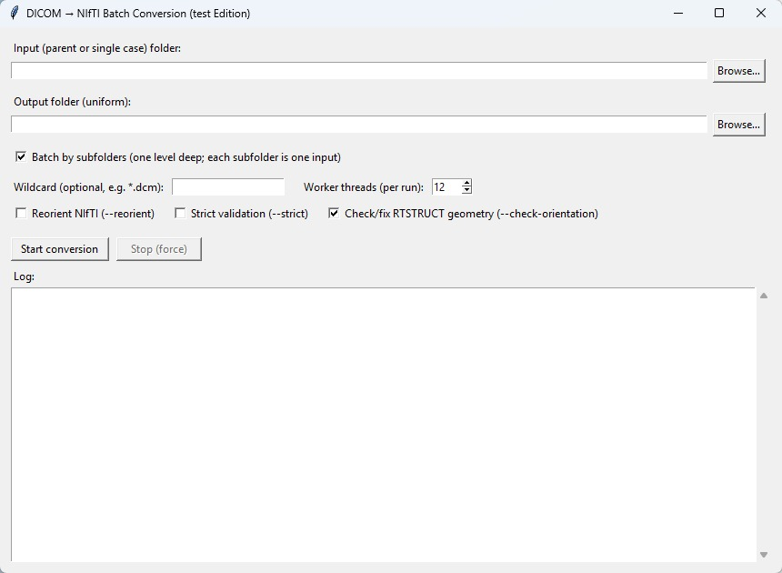

# DCM2NII-Tool

DCM2NII-Tool converts MRI DICOM sequences into compressed NIfTI files (`.nii.gz`).
Each MRI sequence is converted and saved as an individual output file.

## Support This Project

If this project is useful for your work, please consider starring the repository to support development and help others discover it.
(Welcome to comment if you find any bugs!)
## Download

Download the executable from Google Drive:

[Dcm2NiiTool.exe](https://drive.google.com/drive/folders/16EQSg1yMdkdAERvF5ZzeAB1C7Oy_eNcD?usp=share_link)

## UI Preview(I know this UI is ugly)



## What This Tool Does

- Converts MRI DICOM data to NIfTI format (`.nii.gz`)
- Processes all detected MRI sequences
- Saves each sequence as a separate file

## Output

- Output format: `.nii.gz`
- One output file per MRI sequence

## Input Directory Structure

The input directory should be organized as:

```text
input_dir/
  case1_dir/
  case2_dir/
  ...
```

## Platform Support

⚠️ This application is currently supported on Windows only.

This is because the packaged application includes not only Python code, but also OS-specific executable formats and dependencies. A build created on Windows is designed to run on Windows systems and is not directly compatible with macOS. A separate macOS build is required for cross-platform support.

## Notes

- This repository does not store the executable directly because of GitHub file size limits.
- Please download the latest `Dcm2NiiTool.exe` from the Google Drive link above.

